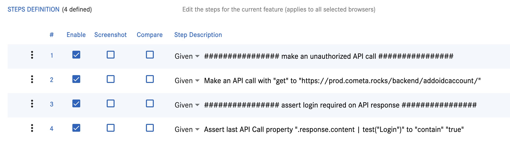

# General Framework and Functionality

## 1. Can we generate random IDs, names, emails, or any digits in the framework?
Create a string of random "{x}" numbers and save to "{variable_name}" 
Anything missing can easily be added.
## 2. Can we store XPath in local variables on a per-feature basis?
Yes
## 3. Can we store all common XPaths of the entire application in a global variable?
Yes - limited department wide. If you create a department, which is common to everybody (e.g. DEFAULT/PUBLIC), then you can share between all users/departments.
## 4. Can we create all common methods in a global feature file to call inside any feature?
Yes. Cometa will detect endless loops like: include f1, which includes F2, F2 includes F3, which includes F1 <- results in feature not to be able to be saved.
## 5. How can we run only smoke test cases if we have 10 smoke and 15 regression feature files in a folder?
Yes: see https://www.youtube.com/watch?v=So_I8CjoRPI - Minute around 5:00
## 6. Can we write custom logic in this framework?
There is a step dedicated to running custom JS methods  
Run Javascript function "{function}"
 
Add your steps here: https://github.com/cometa-rocks/cometa/blob/master/backend/behave/cometa_itself/steps/actions.py
 
See how special steps for testing "IBM Cognos" are grouped here: https://github.com/cometa-rocks/cometa/blob/master/backend/behave/cometa_itself/steps/tools/cognos.py

## 7. Can we directly move to any dependent feature files?

Yes. In the execution result page (L2) click on the step. It will open up the "included" Feature. 

## 8. How can we run all test feature files using a CI/CD pipeline (Jenkins & GitLab after deployment)?

Cometa offers REST API. Anything you can do from the frontend, you can to in the pipeline.
 
E.g. click on "..." of a folder and run all tests inside.
 

## 9. How can we execute smoke and regression test cases feature-wise?
Yes: see https://www.youtube.com/watch?v=So_I8CjoRPI - Minute around 5:00

## 10. How can we integrate our scripts into a CI/CD pipeline? For example, if a new build is deployed on the testing server, how will it trigger the script and email the report to the required person?

# Database Testing
## Database Testing feature showcase: https://youtu.be/uGRXoUh3aFA

## 11. How can we connect to our database server using the framework?

See video.

## 12. How can we read, write, update, and delete data using the framework?

See video.

## 13. If I want to retrieve some data from the database, how can we do it?

Yes it's possible. You can assert on the result using JQ.

## 14. Please show how to perform database testing.

See video.

# Mobile and Performance Testing
## Mobile testing feature showcase: "mobile video here"
## Load testing feature showcase: https://youtu.be/hWAyx6iBbU4
## 15. How can we create a mobile department and explain all related functionalities?

## 16. How can we perform performance testing (load, stress) using the framework?
See video.
## 17. Please show us how to do non-functional testing (load, stress).
See video.
# Cloud Execution

## 18. How can we run our code in the cloud?
Cometa can be used as SaaS or be installed on-premisses or on-cloud. 

Cometa Team can install as well as maintain where ever you want. 

Sharing Features between installations per copy and import - without transportation of variables. 

# String Methods in the Framework

Cometa uses JQ for that: https://jqlang.org/manual/  

Step: Assert variable "{variable_name}" using jq_pattern "{jq_pattern}" to "{condition}" "{value}" 

Here is an example were Cometa asserts on a String comparison to be true 

See for example the Uppercase and Lowercase comparison: https://jqlang.org/manual/#regular-expressions  

We believe that all subsequent questions can be answered by JQ.

## 19. How would you verify if two strings are exactly the same in the framework?
## 20. What is the difference between equals and == when comparing strings?
## 21. How would you compare two strings while ignoring their case in the framework?
## 22. Can equalsIgnoreCase be used to compare strings with special characters?
## 23. How would you check if a string contains a specific substring in the framework?
## 24. What does the contains method return if the substring is not found?
## 25. How would you verify if a string starts with a specific prefix in the framework?
## 26. What happens if the prefix is longer than the string itself?
## 27. How would you check if a string ends with a specific suffix in the framework?
## 28. Can endsWith be used with an empty string?
## 29. How would you verify if a string is empty in the framework?
## 30. What is the difference between isEmpty and checking if the string is null?
## 31. How would you determine the length of a string in the framework?
## 32. What does the length method return for an empty string?
## 33. How would you check if a string matches a specific regular expression in the framework?
## 34. Can matches be used to validate email addresses or phone numbers?
## 35. How would you replace a specific character or substring in a string in the framework?
## 36. What happens if the substring to be replaced is not found?
## 37. How would you replace all occurrences of a substring or pattern in a string in the framework?
## 38. What is the difference between replace and replaceAll?
## 39. How would you convert a string to lowercase in the framework?
## 40. Does toLowerCase modify the original string?
## 41. How would you convert a string to uppercase in the framework?
## 42. Can toUpperCase handle non-English characters?
## 43. How would you remove leading and trailing whitespace from a string in the framework?
## 44. Does trim remove spaces between words in a string?
## 45. How would you extract a portion of a string in the framework?
## 46. What happens if the start or end index is out of bounds?
## 47. How would you compare two strings lexicographically in the framework?
## 48. What does a negative, zero, or positive return value from compareTo indicate?
## 49. How would you compare two strings lexicographically while ignoring case in the framework?
## 50. What is the difference between compareTo and compareToIgnoreCase?
## 51. How would you find the index of a specific character or substring in a string in the framework?
## 52. What does indexOf return if the character or substring is not found?
## 53. How would you find the last occurrence of a specific character or substring in a string in the framework?
## 54. What is the difference between indexOf and lastIndexOf?
## 55. How would you retrieve a character at a specific index in a string in the framework?
## 56. What happens if the index is out of bounds?
## 57. How would you split a string into an array based on a delimiter in the framework?
## 58. What happens if the delimiter is not found in the string?

# User Roles and Administration

## 59. My user role is ANALYSIS. Is it okay for me to lead my project, or is it possible to have project/department-wise admin roles?

Cometa comes with a lot of capabilities, which can be assigned to a role: 

In the screenshot you can see that "Access to Edit a department" can be given to a certain role like "Department Admin" to add or delete users.
## 60. How can we assign and manage project/department-wise admin roles?
See above.
