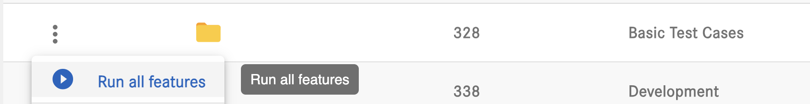
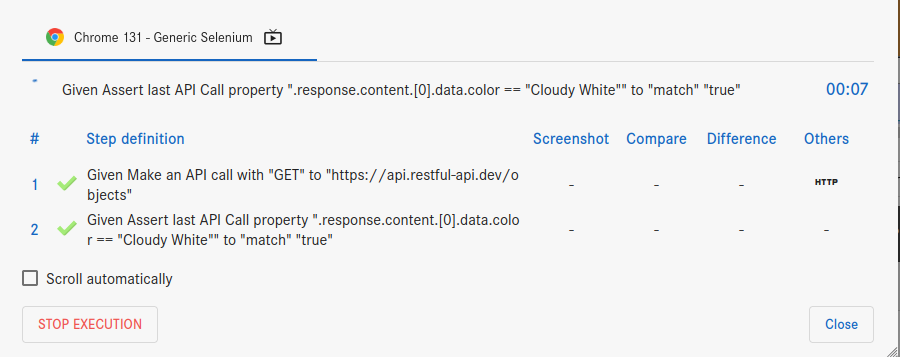
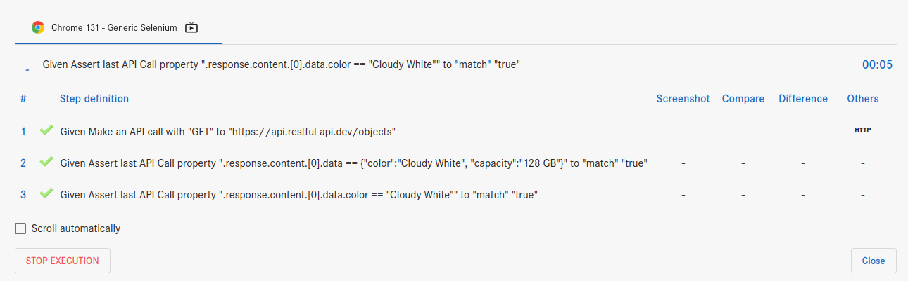
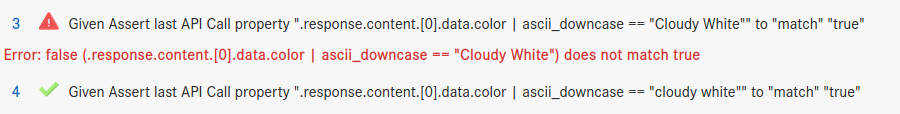
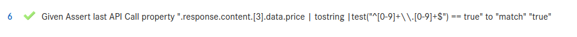
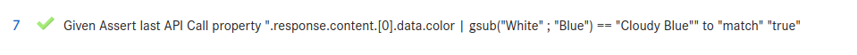
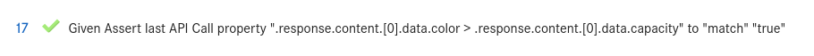
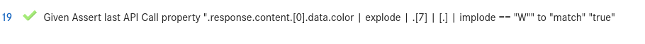

# General Framework and Functionality

### 1. How to generate random IDs, names, emails, or any digits in the framework
Create a string of random "{x}" numbers and save to "{variable_name}" 
Anything missing can easily be added.
### 2. Is it possible to store XPath in a local variables on a per-feature basis?
Yes
### 3. Is it possible to store all common XPaths of the entire application in a global variable?
Yes - limited department wide. If you create a department, which is common to everybody (e.g. DEFAULT/PUBLIC), then you can share between all users/departments.
### 4. Is it possible to create all common methods in a global feature file to call inside any feature?
Yes. Cometa will detect endless loops like: include f1, which includes F2, F2 includes F3, which includes F1 <- results in feature not to be able to be saved.
### 5. How to run only smoke test cases when having multiple smoke and regression feature files in a folder
See https://www.youtube.com/watch?v=So_I8CjoRPI - Minute around 5:00
### 6. Is it possible to write custom logic in this framework?
There is a step dedicated to running custom JS methods  
Run Javascript function "{function}"
 
Add your steps here: https://github.com/cometa-rocks/cometa/blob/master/backend/behave/cometa_itself/steps/actions.py
 
See how special steps for testing "IBM Cognos" are grouped here: https://github.com/cometa-rocks/cometa/blob/master/backend/behave/cometa_itself/steps/tools/cognos.py

### 7. Is it possible to directly move to any dependent feature files?

Yes. In the execution result page (L2) click on the step. It will open up the "included" Feature. 

### 8. How to run all test feature files using a CI/CD pipeline like Jenkins or GitLab after deployment

Cometa offers REST API. Anything you can do from the frontend, you can to in the pipeline.
 
E.g. click on "..." of a folder and run all tests inside.
 

### 9. Executing smoke and regression test cases feature-wise?
See https://www.youtube.com/watch?v=So_I8CjoRPI - Minute around 5:00

### 10. How to integrate scripts into a CI/CD pipeline? For example, if a new build is deployed on a testing server, how will it trigger the script and email the report to the required recipient

# Database Testing
### Database Testing feature showcase: https://youtu.be/uGRXoUh3aFA

### 11. How to connect to our database server using the framework

Please watch the video on Database Testing linked above.

### 12. How to read, write, update, and delete data using the framework

Please watch the video on Database Testing linked above.

### 13. How to retrieve data from the database

You can assert on the result using JQ.

### 14. How to perform database testing

Please watch the video on Database Testing linked above.

# Mobile and Performance Testing
### Mobile testing feature showcase: "mobile video here"
### Load testing feature showcase: https://youtu.be/hWAyx6iBbU4

### 15. Is it possible to create a mobile department? and what are its related functionalities?

Cometa currently does not feature mobile exclusive departments. 
Please watch the video on Mobile Testing linked above.

### 16. How to perform performance testing (load, stress) using the framework
Please watch the video on Load Testing linked above.
### 17. How to do non-functional testing like load or stress.
Please watch the video on Load Testing linked above.
# Cloud Execution

### 18. Is it possible to run code in the cloud?
Cometa can be used as SaaS or be installed on-premises or on-cloud. 

Cometa Team can install as well as maintain where ever you want. 

Sharing Features between installations per copy and import - without transportation of variables. 

# String Methods in the Framework

## Cometa uses JQ for everything related to string and json object manipulation please follow this manual and the examples below in case of doubts: https://jqlang.org/manual/  

  
<h2>Cometa test in json format used in the following questions<h2>

  [{"enabled":true,"screenshot":false,"step_keyword":"Given","compare":false,"step_content":"Make an API call with \"GET\" to \"https://api.restful-api.dev/objects\"","step_action":"Make an API call with \"{method}\" to \"{endpoint}\" with \"params:{parameters}\" and \"headers:{headers}\" and \"body:{body}\"","step_type":"normal","continue_on_failure":false,"timeout":60},{"enabled":true,"screenshot":false,"step_keyword":"Given","compare":false,"step_content":"################ This step compares 2 objects ################","step_action":"","step_type":"normal","continue_on_failure":false,"timeout":60},{"enabled":true,"screenshot":false,"step_keyword":"Given","compare":false,"step_content":"Assert last API Call property \".response.content.[0].data == {\"color\":\"Cloudy White\", \"capacity\":\"128 GB\"}\" to \"match\" \"true\"","step_action":"Assert last API Call property \"{jq_pattern}\" to \"{condition}\" \"{value}\"","step_type":"normal","continue_on_failure":false,"timeout":60},{"enabled":true,"screenshot":false,"step_keyword":"Given","compare":false,"step_content":"################ This step compares 2 strings ignoring case of input ################","step_action":"","step_type":"normal","continue_on_failure":false,"timeout":60},{"enabled":true,"screenshot":false,"step_keyword":"Given","compare":false,"step_content":"Assert last API Call property \".response.content.[0].data.color | ascii_downcase == \"cloudy white\"\" to \"match\" \"true\"","step_action":"","step_type":"normal","continue_on_failure":false,"timeout":60},{"enabled":true,"screenshot":false,"step_keyword":"Given","compare":false,"step_content":"################ This step checks length  ################","step_action":"","step_type":"normal","continue_on_failure":false,"timeout":60},{"enabled":true,"screenshot":false,"step_keyword":"Given","compare":false,"step_content":"Assert last API Call property \".response.content.[0].data.color | length == 12\" to \"match\" \"true\"","step_action":"Assert last API Call property \"{jq_pattern}\" to \"{condition}\" \"{value}\"","step_type":"normal","continue_on_failure":false,"timeout":60},{"enabled":true,"screenshot":false,"step_keyword":"Given","compare":false,"step_content":"################ This step checks if input contains Indicated Letter ################","step_action":"","step_type":"normal","continue_on_failure":false,"timeout":60},{"enabled":true,"screenshot":false,"step_keyword":"Given","compare":false,"step_content":"Assert last API Call property \".response.content.[0].data.color | index(\"C\") != null\" to \"match\" \"true\" ","step_action":"","step_type":"normal","continue_on_failure":false,"timeout":60},{"enabled":true,"screenshot":false,"step_keyword":"Given","compare":false,"step_content":"################ This step tests matching number -> cast to string to regex ################","step_action":"","step_type":"normal","continue_on_failure":false,"timeout":60},{"enabled":true,"screenshot":false,"step_keyword":"Given","compare":false,"step_content":"Assert last API Call property \".response.content.[3].data.price | tostring |test(\"^[0-9]+\\\\.[0-9]+$\") == true\" to \"match\" \"true\" ","step_action":"","step_type":"normal","continue_on_failure":false,"timeout":60},{"enabled":true,"screenshot":false,"step_keyword":"Given","compare":false,"step_content":"################ This step replaces substring with another substring ################","step_action":"","step_type":"normal","continue_on_failure":false,"timeout":60},{"enabled":true,"screenshot":false,"step_keyword":"Given","compare":false,"step_content":"Assert last API Call property \".response.content.[0].data.color | gsub(\"White\" ; \"Blue\") == \"Cloudy Blue\"\" to \"match\" \"true\" ","step_action":"","step_type":"normal","continue_on_failure":false,"timeout":60},{"enabled":true,"screenshot":false,"step_keyword":"Given","compare":false,"step_content":"################ This step extracts a portion of a string using indexes ################","step_action":"","step_type":"normal","continue_on_failure":false,"timeout":60},{"enabled":true,"screenshot":false,"step_keyword":"Given","compare":false,"step_content":"Assert last API Call property \".response.content.[0].data.color | .[2:8] == \"oudy W\"\" to \"match\" \"true\" ","step_action":"","step_type":"normal","continue_on_failure":false,"timeout":60},{"enabled":true,"screenshot":false,"step_keyword":"Given","compare":false,"step_content":"################ This step compares two strings lexicographically replace with '==', '>' and '<' ################","step_action":"","step_type":"normal","continue_on_failure":false,"timeout":60},{"enabled":true,"screenshot":false,"step_keyword":"Given","compare":false,"step_content":"Assert last API Call property \".response.content.[0].data.color > .response.content.[0].data.capacity\" to \"match\" \"true\"","step_action":"Assert last API Call property \"{jq_pattern}\" to \"{condition}\" \"{value}\"","step_type":"normal","continue_on_failure":false,"timeout":60},{"enabled":true,"screenshot":false,"step_keyword":"Given","compare":false,"step_content":"################ This step checks for a specific character in a specific index ################","step_action":"","step_type":"normal","continue_on_failure":false,"timeout":60},{"enabled":true,"screenshot":false,"step_keyword":"Given","compare":false,"step_content":"Assert last API Call property \".response.content.[0].data.color | explode | .[7] | [.] | implode == \"W\"\" to \"match\" \"true\"","step_action":"Assert last API Call property \"{jq_pattern}\" to \"{condition}\" \"{value}\"","step_type":"normal","continue_on_failure":false,"timeout":60}]

### 19. How to verify if two strings are exactly the same in the framework
With action "Assert last API call", using JQ, we can compare strings such as:

 
In this example we compare the color of an object and check if the output is true

### 20. What is the difference between equals and == when comparing strings?

As of now there is no equals() filter in JQ, '==' is used to compare both strings and objects alike.
 

### 21. How to compare two strings while ignoring their case in the framework

Adding "| ascii_downcase" as a filter, will handle input string as lowercase
 
For example:
 
 'response.content.[0].data.color | ascii_downcase == "cloudy white"' 
 

### 22. Can equalsIgnoreCase be used to compare strings with special characters?
There is no equalsIgnoreCase method in jq. However, "ascii_downcase will only affect characters that have a lowercse counterpart in ASCII. 
For example "Hello@//(())??*¿¿" | ascii_downcase will only affect the first 'H'

For non ASCII characters like unicode, preprocessing the string will be the best solution. 

### 23. How to check if a string contains a specific substring in the framework

Using index(< substring >). 
This will return the starting index of the substring if found, else it will return null 

We can check the existence of a substring by using:  

Assert last API Call property ".response.content.[0].data.color | index("C") != null" to "match" "true"  
 Being the input "Cloudy White", the return should be 0 != null -> true.

### 24. What does the contains method return if the substring is not found?

See above

### 25. How to verify if a string starts with a specific prefix in the framework

Assert last API Call property ".response.content.[0].data.color | index("C") == 0" to "match" "true"  

This example checks if "C" prefix is found as a substring in index 0.

### 26. What happens if the prefix is longer than the string itself?

index() returns null

### 27. How to check if a string ends with a specific suffix in the framework

For this usecase, use endswith(< suffix >). Returning a boolean whether it finds it or not.

### 28. Can endsWith be used with an empty string?

Yes, it can. Unless the substring is an empty string, it will return false.

### 29. How to verify if a string is empty in the framework

Use length method
 
Example:
 
Assert last API Call property ".response.content.[0].data.color | length == 0" to "match" "true" 

### 30. What is the difference between isEmpty and checking if the string is null?

jq does not have a isEmpty method, however checking with '==' can be used to check if the string is "" empty or null

### 31. How to determine the length of a string in the framework

Use length method
 
Example:
 
Assert last API Call property ".response.content.[0].data.color | length == 0" to "match" "true" 

### 32. What does the length method return for an empty string?

0

### 33. How to check if a string matches a specific regular expression in the framework

 

In this example we use a regular expression to check if the input is a price number followed by a '.' followed by cents 
Also added tostring to parse the price as a string.

### 34. Can matches be used to validate email addresses or phone numbers?

Yes, to validate an email use the same logic of regular expressions displayed in JQ Manual 
Example for Email:  ^[a-zA-Z0-9._%+-]+@[a-zA-Z0-9.-]+\\.[a-zA-Z]{2,}$

 
Example for Phone (Spanish format 9 digit): ^[0-9]{9}$

### 35. How to replace a specific character or substring in a string in the framework

use gsub() method

### 36. What happens if the substring to be replaced is not found?

gsub() returns the original, string, unmodified

### 37. How to replace all occurrences of a substring or pattern in a string in the framework

gsub() also replaces all occurrences it finds of the first argument, with the second

### 38. What is the difference between replace and replaceAll?

These methods are not available in JQ, gsub() provides all the tools necessary for string manipulation.

### 39. How to convert a string to lowercase in the framework

ascii_downcase

### 40. Does toLowerCase modify the original string?

No, jq functions are immutable; they return new values.

### 41. How to convert a string to uppercase in the framework

ascii_upcase

### 42. Can toUpperCase handle non-English characters?

ascii_upcase and ascii_downcase work only for ASCII characters. Other Unicode cases require external handling

### 43. How to remove leading and trailing whitespace from a string in the framework

Use ltrimstr(string) and rtrimstr(string)  

Both functions output the input without the prefix/suffix indicated as argument, if it exists.

### 44. Does trim remove spaces between words in a string?

The above methods only remove leading and trailing strings

### 45. How to extract a portion of a string in the framework

Use .[start, finish]
 
Example: Given Assert last API Call property ".response.content.[0].data.color | .[2:8] == "oudy W"" to "match" "true"

### 46. What happens if the start or end index is out of bounds?

When indexes are out of bounds, .[x,y]  
If index goes beyond the max length, index is treated as max length 
if index is negative, it will count from the end

Example: "Cloudy White" 
[0:9999] -> "Cloudy White" 
[99:9999] -> "" 
[-4:11] -> "hit" 
[1:-4] -> "loudy W" 

### 47. How to compare two strings lexicographically in the framework

Use '==', '>', '<' for lexicographical comparison 

### 48. What does a negative, zero, or positive return value from compareTo indicate?

jq doesn't have compareTo, but lexicographic comparison is done using <, >, and ==.

### 49. How to compare two strings lexicographically while ignoring case in the framework

Convert both to lowercase using ascii_downcase before comparison.

### 50. What is the difference between compareTo and compareToIgnoreCase?

See #48 and #49

### 51. How to find the index of a specific character or substring in a string in the framework

use index(), it will return the index of the character / first character in the substring

### 52. What does indexOf return if the character or substring is not found?
    
index returns null if not found.

### 53. How to find the last occurrence of a specific character or substring in a string in the framework

Use rindex(string)

### 54. What is the difference between indexOf and lastIndexOf?
indexOf and lastIndexoff while not present in jq index and rindex will do the same. 
index(string) finds the first match, rindex(string) finds the last.

### 55. How to retrieve a character at a specific index in a string in the framework

with explode and implode 

explode, creates an array with the string's codepoint number of each character.

implode, reverses the explode

So in the following example, we get "Cloudy White"

after explosion -> [67,108,111,117,100,121,32,87,104,105,116,101] 

select index 7 -> 87

Insert it into a single element array [87], this is because implode requires an array, hence adding [.]

Finally we implode, reversing [87] into -> "W"

### 56. What happens if the index is out of bounds?

Returns null if the index is out of range.

### 57. How to split a string into an array based on a delimiter in the framework

We use split() method

### 58. What happens if the delimiter is not found in the string?

split() returns an array with the original string as the only element, if delimiter is not found.

# User Roles and Administration

### 59. My user role is ANALYSIS. Is it okay for me to lead my project, or is it possible to have project/department-wise admin roles?

Cometa comes with a lot of capabilities, which can be assigned to a role: 

In the screenshot you can see that "Access to Edit a department" can be given to a certain role like "Department Admin" to add or delete users.
### 60. How can we assign and manage project/department-wise admin roles?
See above.

# Data Driven Testing
### 61. Can we write data on Excel sheet(If excel used on Data driven).

Yes, use step: Edit "{file}" and set "{value}" to "{cell}"

### 62. Excel sheet should be Auto-save if we manipulate data after uploading.

Excel file is automatically saved and will contain the value set to the cell on next run.