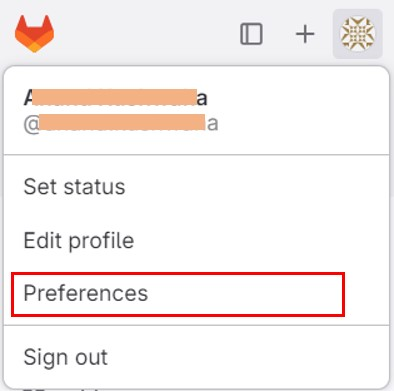
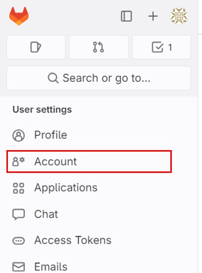
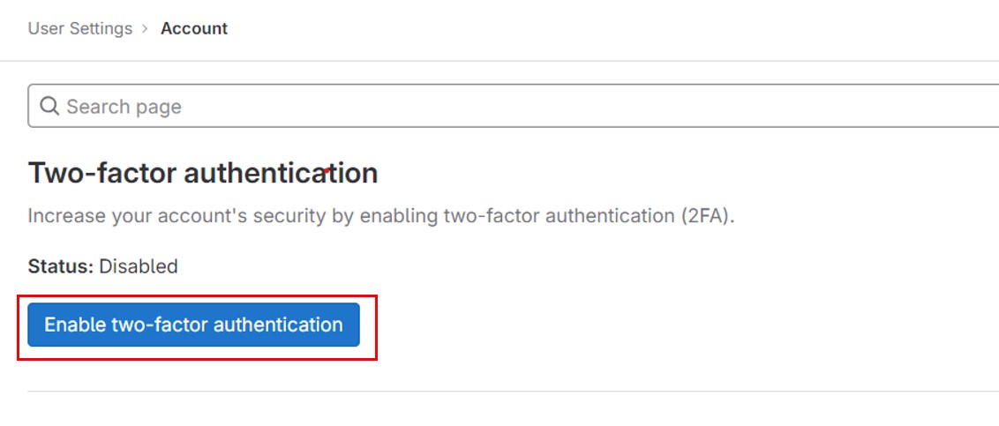
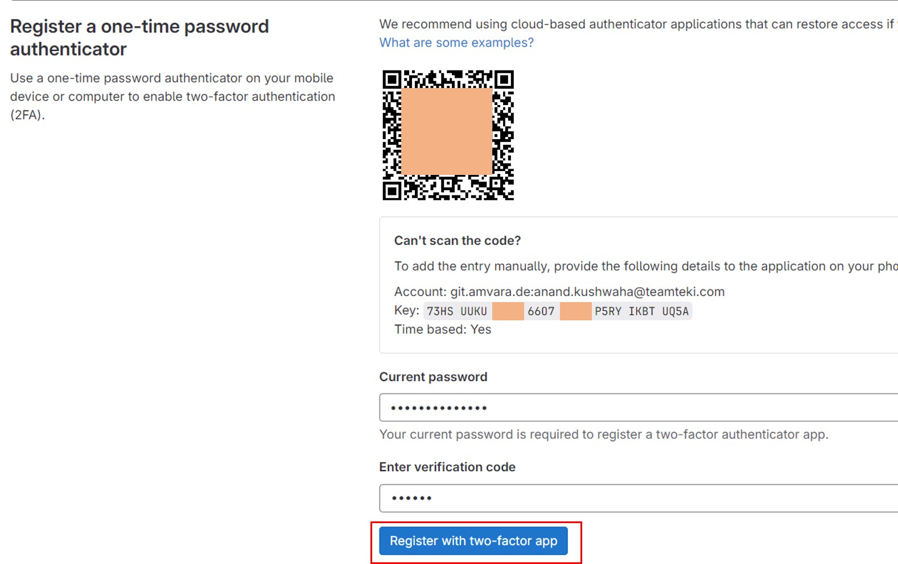
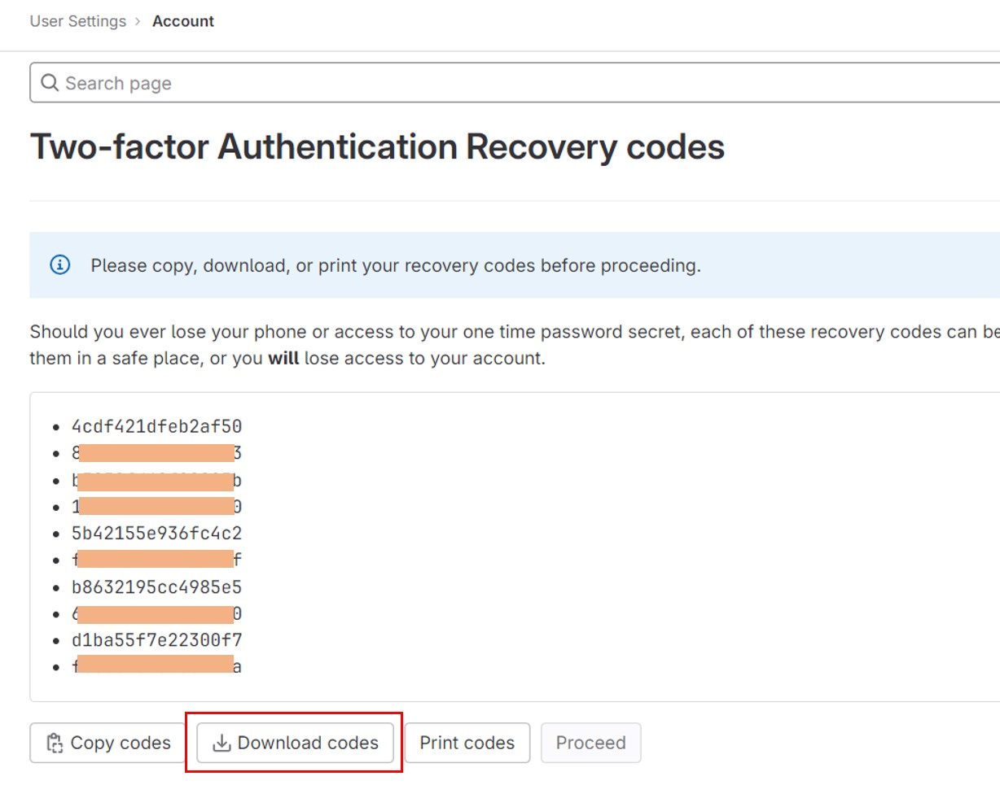

 

# Setting up Co.meta login with MFA (Muti Factor Authentication) 

## 1. MFA with OTP (One Time Password)

>### OTP (One Time Password)
>> A one-time password (OTP), also known as a one-time PIN, one-time authorization code (OTAC) or dynamic password, is a password that is valid for only one login session or transaction, on a computer system or other digital device.
>> 
>> 
>> OTP generation algorithms make use of pseudorandomness to generate a shared key.
>>  
>>  
>><b>Source: Wikipedia</b>

> ### Prepair MFA with GitLab
> 
>><strong>Step 1:</strong>Login to your Gitlab Account  
>
>><strong>Step 2:</strong> Click Profile Icon > "Preferences"  
>>   
>
>> <strong>Step 3:</strong> Click "Account"  
>>  
>
>> <strong>Step 4:</strong> Click "Enable Two Factor Authentication"  
>>  
>
>> <strong>Step 5:</strong> Enter "YOUR_Current_PASSWORD" and "Varification Code", Then Click "Register with two-factor app"   
>>  
>><strong>1st Way: To Get Verfication Code</strong>
>>> 1. Scan a QR Code in any authenticator app i.e [Google Authenticator](https://play.google.com/store/apps/details?id=com.google.android.apps.authenticator2), [Microsoft Authenticator](https://play.google.com/store/apps/details?id=com.azure.authenticator) etc 
>>> 2. You will see you Gitlab account listed in Authenticator app, 
>>> 3. Now, In the authenticator app go in your account and get the OTP   <i>Note: OTP will be valid for 60 seconds</i>
>> 
>><strong>2nd Way: To Get Verfication Code : Manually</strong>
>>> 1. Use pyAuth library to generate OTPs – see: https://github.com/pyauth/pyotp 
>>>> Note: 
>>>> 1. Machine with has python installed in it can run this code with library [pyotp](https://github.com/pyauth/pyotp) 
>>>> 2. Need to install pyotp to run this code  
>>>>><i>$pip install pyotp</i> 
>>>> <pre>import pyotp
>>>> token = "YOUR CODE .... .... .... .... .... ...." # i.e 'HHHH LLLL KKKK JJJJ LLLL DDDD' or ABCDEFGHIJKLMNOPQRSTUVW
>>>> token = token.replace(" ","")
>>>> totp = pyotp.TOTP(token)
>>>> otp = totp.now()
>>>> print("OTP : ", otp)</pre>
>>>> 3. You will get the OTP
>
>> <strong>Step 5:</strong> Click "Download Codes" and have it in some secured place"  
    This will complete your MFA successfully 
>>  

### Go to your Co.meta login page  
>
>> <strong>Step 1:</strong> Enter Capcha  
>> <strong>Step 2:</strong> Select Login with Gitlab  
>> <strong>Step 3:</strong> Enter Gitlab UserID 
>> <strong>Step 4:</strong> Enter Gitlab Password 
>> <strong>Step 5:</strong> Click SignIn 
>> <strong>Step 6:</strong> Get Varificaion Code 
>>> 1. From your Authenticator App  
>>> Or 
>>> 2. From your pyotp library (python Script): Perform same step as [5.2 Get Verfication Code : Manually](#MANUAL_OTP)
>>
>> <strong>Step 7:</strong> Enter OTP
>> <strong>Step 8:</strong> Your will be logged in with MFA

