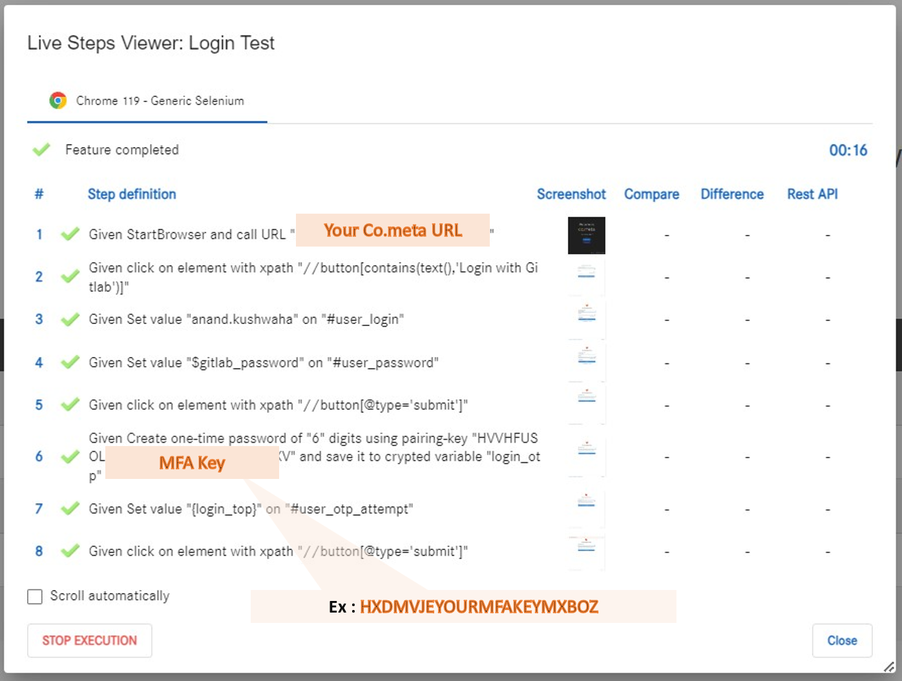

# Automation of Muti Factor Authentication with Cometa
Muti factor authentication which are done by One time password can be automated using Cometa 

## 1. MFA and OTP

* **MFA (Muti Factor Authentication)**
    Multi-factor authentication (**MFA**, **two-factor authentication**, or **2FA**, along with similar terms) is an electronic authentication method in which a user is granted access to a website or application only after successfully presenting two or more pieces of evidence (or factors) to an authentication mechanism. 
     
     
    **Source [Wikipedia](https://en.wikipedia.org/wiki/Multi-factor_authentication)** 
     
     
* **OTP (One Time Password)**
    A one-time password (OTP), also known as a one-time PIN, one-time authorization code (OTAC) or dynamic password, is a password that is valid for only one login session or transaction, on a computer system or other digital device.
     
    
    OTP generation algorithms make use of pseudorandomness to generate a shared key.
      
      
    <b>Source: [Wikipedia](https://en.wikipedia.org/wiki/One-time_password) </b>
     
     

### Steps of Automation and Prerequisite  

The automation of two-factor authentication at Cometa requires two steps.

* **Step 1: (Prerequisite)** Create an account and obtain the MFA secret key. If you already have an account, you can use that. Next, follow the provided links to set up MFA and obtain the secret key from any one of the multi-factor authentication providers. (This requires at least one MFA setup), **(This requires atleast MFA)**.
            
    **Gitlab** <a href="./Prepare_mfa_with_gitlab.md"> Set up Multi-Factor Authentication (MFA) for in our GitLab.</a>
        
    **Google MFA** Create account at <a href="https://support.google.com/accounts/answer/27441?hl=en">Google</a> then <a href="https://support.kraken.com/hc/en-us/articles/360001486466-How-to-find-the-setup-key-or-backup-code-for-authenticator-app-2FA"> get a <i>secret key</i>. </a>

      You have the option to choose any other MFA provider based on your needs

    Get your first verification code to setup MFA  

    **1st Way:** Get verfication Code using authenticator apps
    * Scan the displayed QR code in any authenticator app, such as [Google Authenticator](https://play.google.com/store/apps/details?id=com.google.android.apps.authenticator2), [Microsoft Authenticator](https://play.google.com/store/apps/details?id=com.azure.authenticator) etc 
    * You will see your GitLab account listed in the authenticator app. 
    * Now, in the authenticator app, navigate to your account and retrieve the OTP. 
    
    **2nd Way:** Get verification code manually ( This step is required to automate the MFA with Cometa)
    * Use pyAuth library to generate OTPs – see: https://github.com/pyauth/pyotp
        
        **Note:** Please install pyotp to run this code using the following command, A machine with Python installed can run this code with the required library [pyotp](https://github.com/pyauth/pyotp)
         
        
        <pre>pip install pyotp</pre>

        Enter your token/secret key, run this code, and you will receive the OTP.

        <pre>  import pyotp
        # i.e 'HHHH LLLL KKKK JJJJ LLLL DDDD DDDD DDDD' or ABCDEFGHIJKLMNOPQRSTUVWTUVWTUVW
        token = "YOUR CODE .... .... .... .... .... ...." 
        token = token.replace(" ","")
        totp = pyotp.TOTP(token)
        otp = totp.now()
        print("OTP : ", otp)</pre>  
     

    <i> Note: OTP will be valid for 60 seconds</i>
     
     

* **Step 2** Create Test  
    Store the <i>secret key</i> in Cometa as a <i>secret variable</i>. Once the authentication token is stored, you can proceed to generate OTP using Cometa by following the next step. 

      Create one-time password of "{x}" digits using pairing-key "{value}" and save it to encrypted variable "{variable_name}
        
    Refer <a target="_blank" href="https://github.com/Cometa-rocks/Cometa_documentation/blob/main/Cometa_actions.md#:~:text=online%20excel%20viewer.-,Create%20one%2Dtime%20password%20of%20%22%7Bx%7D%22%20digits%20using,-pairing%2Dkey%20%22%7Bvalue">Create one-time password using Cometa </a>

        For illustration, you can automate the login process on Cometa to test the functionality of the MFA feature

    **Steps to be automated**

    #### Manual Steps of Cometa login 
    * Fill Captcha

    * Select Login with Gitlab

    * Enter your "Gitlab_UserID"

    * Enter your "Gitlab_Password"

    * Click Sign In

    * Get OTP(Verification Code)

    * Enter OTP
    
    * Your will be logged into Cometa with MFA.

    #### Automation steps of MFA in Cometa.

    * Create a feature in Cometa  

    * Provide a feature name and discription 

    * Please follow the steps, as shown in the screenshot below
     
     
    

