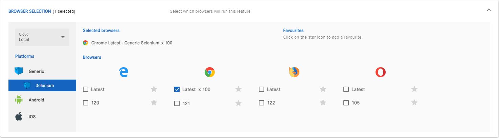

# Browser Concurrency Control Feature

## Overview

Welcome to the Browser Concurrency Control feature! This enhancement empowers users to optimize their performance testing by allowing them to dictate the number of times a browser should run concurrently. This README provides a quick guide on how to make the most out of this exciting new functionality.

## Key Benefits

- **Customized Testing:** Tailor your testing experience to meet your specific needs by adjusting the concurrency settings for browsers.
  
- **Performance Boost:** Improve the efficiency of your performance testing by running multiple instances of a browser simultaneously.

- **User-Friendly Interface:** The feature is designed to be intuitive, ensuring that even non-technical users can take advantage of enhanced browser control.

## Getting Started

1. **Access the Portal:**
   - Depending on your preference, access the feature through the online portal, self-hosted instance, or cloud version.

2. **Create or Modify a Feature:**
   - Start by creating a new feature or modifying an existing one to leverage the Browser Concurrency Control.

3. **Navigate to Browser Selection:**
   - Within the feature settings, go to the browser selection section.

4. **Select Browsers and Adjust Settings:**
   - Choose the browsers you want to execute concurrently and set the desired amount of concurrent browser executions.

5. **Save and Execute:**
   - Save the feature settings and execute the feature to experience the enhanced performance testing with concurrent browsers.

## Feedback

We value your feedback! If you have suggestions, encounter any issues, or want to share your experience with the Browser Concurrency Control feature, please let us know through the [**co.meta's** Github](https://github.com/cometa-rocks/cometa/issues) repository.

## Version History

- v2.8.323: Initial release of Browser Concurrency Control feature.

## License

This feature is released under the [AGPLv3 License](https://github.com/cometa-rocks/cometa/blob/master/LICENSE).

Happy testing! 🚀