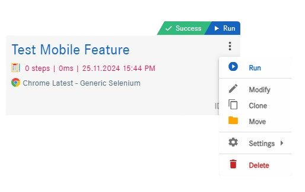
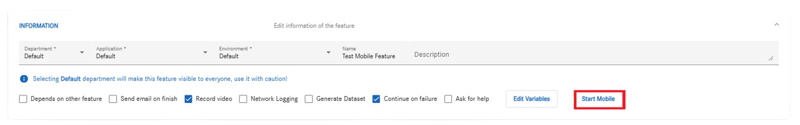
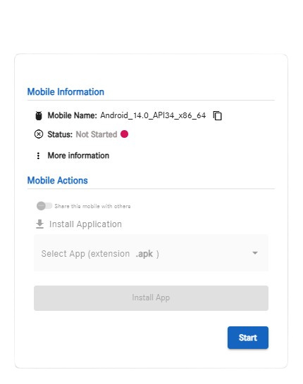
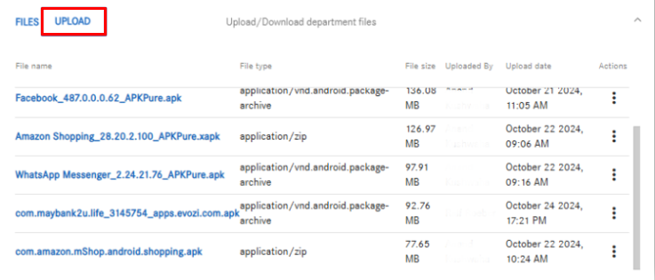
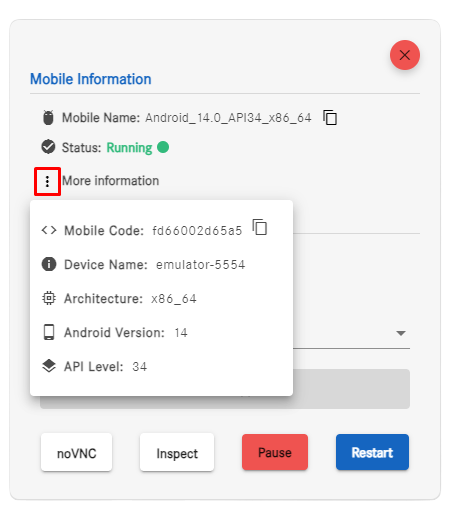
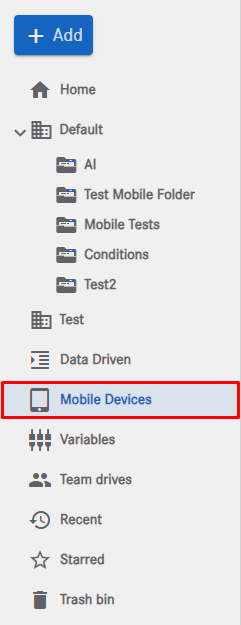
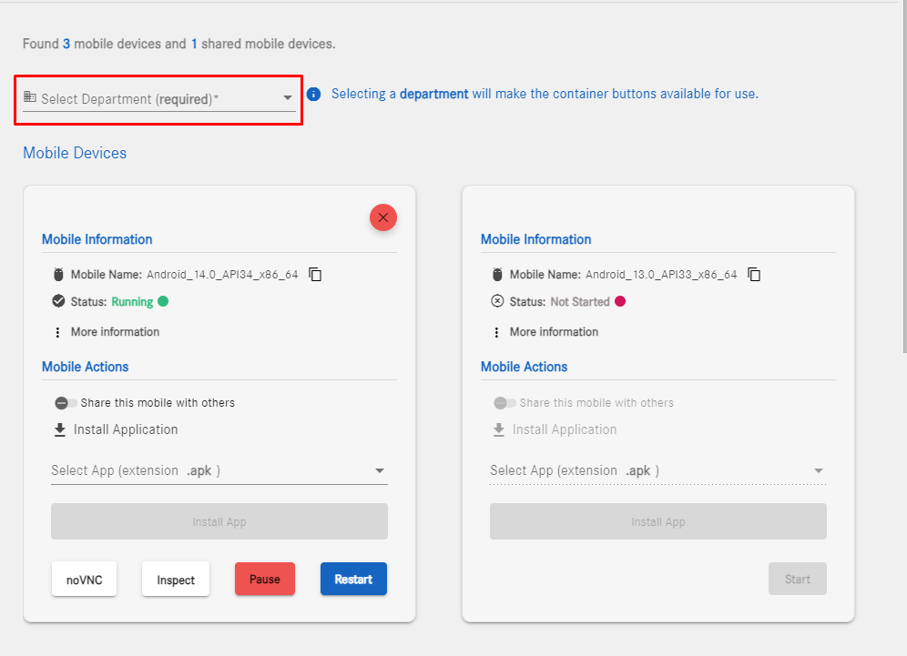
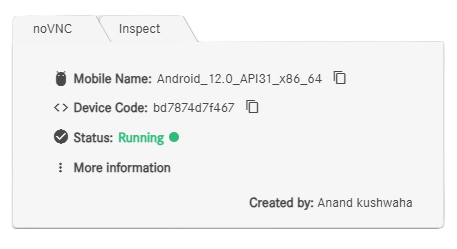
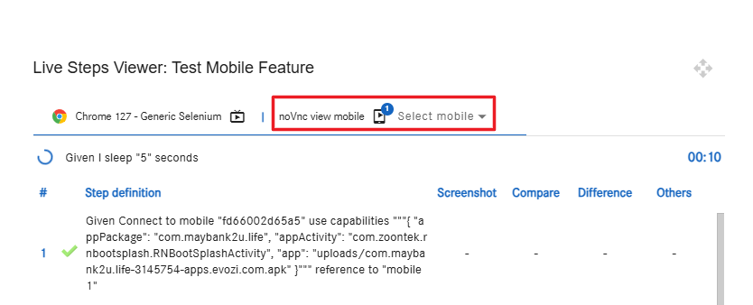
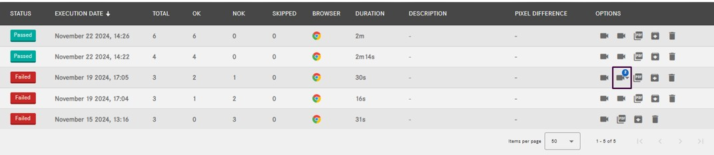

# Co.meta mobile feature 
1. [Start Mobile (Edit Feature)](#start-mobile)
2. [Start Mobile (Landing tree)](#start-mobile)
3. [Shared-mobiles](#start-mobile)
4. [Live steps (Landing tree)](#start-mobile)
5. [Main-view  (Landing tree)](#start-mobile)

 

### Start mobile (Edit Feature) 

Why do we activate the Start button for mobile device containers?

Once manually activated, you will be able to access the mobile device through the predefined steps we provide in the Feature's Step Editor.

These mobile containers can be initialized, paused, and restarted.

You can access mobile containers in two ways:

  * Through the Feature.
  * Through the Landing Tree.

If you want to work with the feature, you need to follow these steps:

Go to the feature of the department you want.

Click on Start Mobile or <strong>shortcut(S)</strong>:

Next step, we have to chose the mobile container and start it:

Note: If you don’t have the package, you must upload it through the Upload option in Edit Feature, ensuring that the package is in APK format.
Additionally, you can install an APK package for the mobile device.

More information:

To see more information, we have to click to more vert:

### Start mobile (Landing Tree)

If you prefer to work from the Landing Tree, select the department you want and use the mobile device functionality as follows:

First select the department and start the mobile device of your choice.

Once the department is selected, the "Start" button will become enabled.

### Shared mobile (Edit Feature) 

To view the mobile devices of other colleagues in the same department, we need to scroll down until we reach "Shared Mobile."

### Live steps (Edit Feature) 

Once the steps related to the mobile device are completed, we will be able to access the noVNC of the desired mobile. 
Once we reach the step where the mobile is loaded, the novnc will become visible, and we can view the mobile.

### Main-view (results) 

Once all steps are completed, the result will appear as the second icon (a camera).
If there's one mobile, it will display directly; if multiple, a dropdown will allow selection.

<h3>Available Buttons</h3>
<h4>1. noVNC</h4> 
<!-- noVNC Functionalities Table -->
<table>
  <thead>
    <tr>
      <th>Feature</th>
      <th>Description</th>
    </tr>
  </thead>
  <tbody>
    <tr>
      <td>Remote Device Visualization</td>
      <td>View the device screen in real-time via a web browser, ideal for debugging and monitoring automated tests.</td>
    </tr>
    <tr>
      <td>Remote Device Control</td>
      <td>Interact with the device using the keyboard and mouse to simulate taps, swipes, and other gestures.</td>
    </tr>
    <tr>
      <td>Test Automation Monitoring</td>
      <td>Run Appium automated tests while observing live progress, quickly identifying visual or functional issues.</td>
    </tr>
    <tr>
      <td>Session Recording</td>
      <td>Record interactions during tests or debugging for later review and analysis.</td>
    </tr>
    <tr>
      <td>Screenshot Capturing</td>
      <td>Take screenshots directly from the noVNC interface for comparison or visual testing.</td>
    </tr>
    <tr>
      <td>Multi-User Access</td>
      <td>Allow multiple users to observe or interact with a device simultaneously, ideal for team collaboration.</td>
    </tr>
    <tr>
      <td>Application Debugging</td>
      <td>Test user interactions in real-time across various devices and resolutions to identify design or functionality issues.</td>
    </tr>
    <tr>
      <td>Virtual Device Management</td>
      <td>Monitor and control emulated devices, adjust emulator settings, or restart devices remotely.</td>
    </tr>
    <tr>
      <td>CI/CD Integration</td>
      <td>Observe automated test runs as part of CI/CD pipelines, ensuring devices are active and functional.</td>
    </tr>
  </tbody>
</table>

<h4>2. Inspector</h4>
<!-- Inspector Functionalities Table -->
<table>
  <thead>
    <tr>
      <th>Feature</th>
      <th>Description</th>
    </tr>
  </thead>
  <tbody>
    <tr>
      <td>UI Element Inspection</td>
      <td>Examine the app structure and element attributes such as ID, XPath, etc.</td>
    </tr>
    <tr>
      <td>Interactive Testing</td>
      <td>Simulate taps, swipes, and text input.</td>
    </tr>
    <tr>
      <td>Test Code Generation</td>
      <td>Generate test code snippets in multiple languages for automated testing.</td>
    </tr>
    <tr>
      <td>Cross-Platform Support</td>
      <td>Inspect both Android and iOS apps with a single tool.</td>
    </tr>
    <tr>
      <td>Appium Server Integration</td>
      <td>Connect to Appium server and execute real-time commands.</td>
    </tr>
    <tr>
      <td>Custom Gestures Validation</td>
      <td>Test custom gestures like zoom or multi-touch.</td>
    </tr>
    <tr>
      <td>Localization Testing</td>
      <td>Verify app behavior in different languages or regions.</td>
    </tr>
    <tr>
      <td>Screenshots and Recording</td>
      <td>Capture screens or record interactions for debugging and analysis.</td>
    </tr>
    <tr>
      <td>Log Monitoring</td>
      <td>View real-time logs for debugging purposes.</td>
    </tr>
    <tr>
      <td>QA Workflow Integration</td>
      <td>Speed up the creation of automation test scripts.</td>
    </tr>
  </tbody>
</table>
