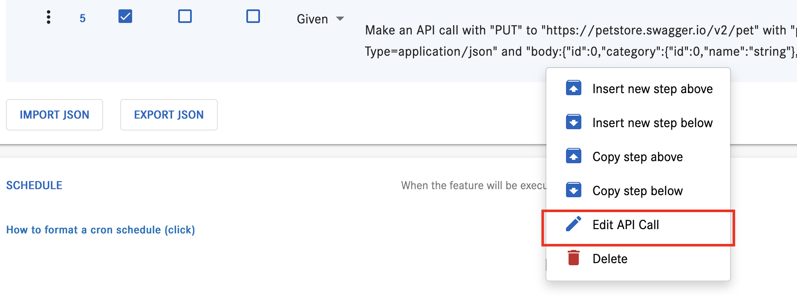
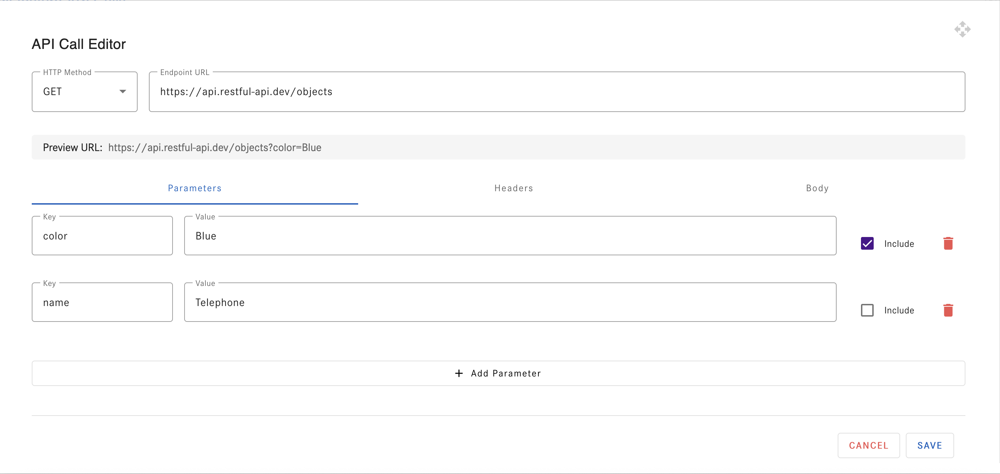

# Co.meta Features Documentation

<picture>
  <source media="(prefers-color-scheme: dark)" srcset="https://raw.githubusercontent.com/cometa-rocks/cometa_documentation/main/img/logos/COMETAROCKS_LogoEslog_Y_W.png">
  <source media="(prefers-color-scheme: light)" srcset="https://raw.githubusercontent.com/cometa-rocks/cometa_documentation/main/img/logos/COMETAROCKS_LogoEslog_Y_B.png">
  
</picture>

> [!TIP]
> - Use your browser's search (Ctrl+F or Cmd+F) to find specific features

## Feature List
1. [Security Feature](#security-feature)
2. [Email Feature](#email-feature)
3. [API Testing](#api-testing)
4. [End-to-End Monitoring](#end-to-end-monitoring)
5. [Load Testing](#load-testing)
6. [Accessibility Testing](#accessibility-testing)
7. [Mobile Testing](#mobile-testing)
8. [AI Feature](#ai-feature)
9. [Multi-Factor Authentication](#multi-factor-authentication)
10. [Data Driven Testing](#data-driven-testing)
11. [Database Testing](#database-testing)
12. [Historical Analysis Feature](#historical-analysis-feature)

## Security Feature

### What is the Security Feature?
The Security Feature helps identify and validate network response headers that might expose sensitive information. It helps prevent security vulnerabilities like XSS, CSRF, and DDoS attacks.

### Key Capabilities
- Records and validates network response headers
- Filters sensitive information
- Displays vulnerability counts in real-time
- Provides detailed step reports for vulnerable headers
- Shows network responses with:
  - URL information
  - Status codes
  - Headers
  - Cookies
  - Redirects
  - Timing information

### Detailed Information
Exposing detailed information about the server, backend technologies, or other components running on the web server can pose a security risk. This information is often referred to as "server headers" or "HTTP response headers". It includes details such as the web server software, server version, programming language, and other technologies in use.

If information about the server's application reveals the presence of vulnerabilities such as XSS, CSRF, DDoS, or others, it increases the risk of malicious activities. Attackers armed with this knowledge could exploit the identified vulnerabilities, potentially leading to harmful consequences.

For a better understanding of HTTP response headers vulnerabilities, please refer [X-Powered-By](https://www.zaproxy.org/docs/alerts/10037/), [Server](https://www.zaproxy.org/docs/alerts/10036-2) and [HTTP response headers cheet sheets](https://cheatsheetseries.owasp.org/cheatsheets/HTTP_Headers_Cheat_Sheet.html#server). 

#### The Cometa has introduced the feature
During feature execution, Cometa records and validates network response headers filters the ones exposing sensitive information, and displays the count in real time. After execution, users can check the step report for details on vulnerable headers and network responses, aiding in understanding.

The network Response list item contains 2 sections:

1. [Vulnerable Headers List](#vulnerable-headers-list)
2. [Network Response](#network-response)

#### Vulnerable Headers List
The list presents vulnerable headers and their values in a JSON key-value pair format.

#### Network Response
The network response refers to the data returned by a server in response to an HTTP request made by a client. It includes various pieces of information, which can be analyzed by referring to network responses.

* **URL** Indicates the endpoint that was requested, providing information about the resource accessed.
* **Status Code** Indicates the success, failure, or other conditions of the request (e.g., 200 for success, 404 for not found, 500 for server error).
* **Headers** Metadata associated with the response, including content type, content length, caching directives, and more.
* **Cookies** Information set by the server in cookies, which can be used for tracking, session management, or other purposes.
* **Redirects** If the response is a redirection, you can get the URL to which it redirects and the type of redirection (e.g., 301 for permanent, 302 for temporary).
* **Timing Information** Details about how long it took for the server to respond (e.g., latency, time to first byte).

#### Activate Security Feature in Cometa
When creating a feature in Cometa, the Information section includes an option to enable the Network Logging feature, allowing users to enable or disable this security functionality.

> **Note:** Enabling this checkbox will record all your network response headers and store them in the database, potentially increasing the data load. Therefore, if the feature is not in use, please kindly consider disabling the checkbox.   


#### Refer To Report
Cometa will display a list of network responses within the step report. This list will show which network responses were received during each step. Specifically, if a step takes 2 seconds to execute, any network responses received during those 2 seconds will be stored alongside the step.

In the OPTIONS section of the Step Report, you should find the following icon.

> **Note:** In case of vulnerabilities, a red indicator will be shown; otherwise, the color will be gray.

1. This indicates that the network header has been recorded and does have vulnerabilities.

    
    <br><br>
1. This indicates that the network header has been recorded and does not have vulnerabilities.

    
    <br><br>
1. Click on the icon shown above to view the list of responses.

     

4. The JSON data can be analyzed using JQ patterns. Please refer [JQ Documentation](https://jqlang.github.io/jq/manual/) to learn about patterns.

## Email Feature

### What is the Email Feature?
The Email Feature enables sending notifications upon completion or failure of test executions, with customizable email templates and screenshot attachments.

### Key Capabilities
- Configure recipient email addresses (To, CC, BCC)
- Custom email subject and message body
- HTML template support
- Screenshot attachments
- Conditional email sending (Always/On error)
- PDF report attachments
- Custom template options

### Steps to Configure the Email Feature

1. **In the create Feature screen navigate to the EMAIL TEMPLATE section**
   <br>
   <br>
    

2. **Add Recipient Email Addresses**:
    - In the field labeled "Email address, use tab to separate emails," enter the email addresses of the recipients. Separate multiple email addresses by pressing the `Tab` key.
    - Example: `abc@xyz.com`

3. **CC (Carbon Copy)**:
    - This field allows you to include additional recipients who will receive a copy of the email. The recipients listed here can see each other's email addresses. Use tabs to separate multiple email addresses. 
    - Separate multiple email addresses by pressing the `Tab` key.
      - Example: `abc@xyz.com`

4. **BCC (Blind Carbon Copy)**:
    - This field is used for entering email addresses of recipients who will receive the email without other recipients being aware of it. 
    - Each recipient added here will not be able to see the other addresses listed in this field. Use tabs to separate multiple email addresses.
    - Separate multiple email addresses by pressing the `Tab` key.
      - Example: `abc@xyz.com`

5. **Subject**:
    - Enter the subject of your email in the "Subject" field. If you leave this field empty, a default subject will be used.
    - Example: `Subject. Leave it empty for a default subject.`

6. **Message Body**:
    - Enter the body of your email in the "Message Body" field. If left empty, a default message with information about the feature will be used.
    - You can create a custom body using an HTML template and include screenshots as shown below.
   Example:
    ```html
    Hi Mr, ABC
    <br>
    Please find attached Screenshots for details
    <br>
    $screenshot[1]
    <br>
    <br> Screen shot for second screen
    <br>
    $screenshot[2]
    <br>
    <br>
    $screenshot[3]
    <br>
    <br>
    <br>Thanks, 
    <br><b>Feature Name</b>
    <br><b>Co.meta</b>
    ```
    - Screenshots will be included in the email body in the sequence they are enabled in the steps. The placeholders $screenshot[1], $screenshot[2], etc., correspond to the screenshots of the steps that have the screenshot option enabled.
    - When an email is received, you will see that the screenshots are attached as images in the same sequence as they are mentioned in the mail body template above.

7. **Email Sending Conditions**: Choose when to send the email:
    - **Always**: Sends an email regardless of the task's outcome.
    - **On error**: Sends an email only if the task encounters an error.

8. **Additional Options**:
    - **Do not use default template**: Check this option if you do not want to use the default email template, By default this is Off.
    - **Attach PDF report to email**: Check this option if you want to attach a PDF report to the email, By default this is On.

## API Testing

### What is the API Testing Feature?
Cometa provides robust API testing capabilities for validating backend services and APIs alongside UI tests.

### Key Capabilities
- RESTful API support (GET, POST, PUT, DELETE, PATCH)
- Request configuration (headers, body, authentication)
- Response validation
- JSON schema validation
- Data extraction from responses
- Request chaining
- API call editor with visual interface

### Setting Up API Tests

#### Video Demonstration on API Call Editor: [Video](https://youtu.be/plC8qag08ZQ)

1. **Create a New Feature**: Start by creating a new feature in Cometa.
2. **Add API Step**: In the steps section, start by adding API calling step:

```jq
Make an API call with "{method}" to "{endpoint}" with "params:{parameters}" and "headers:{headers}" and "body:{json_body}" and "row_body:{row_body}"
```

3. **Configure Request**: Right clicking the step, displays the option to edit the request in the Edit API call window. This allows a fast and confortable way to edit the HTTP method, parameters, headers and body of the request.

<br>
<br>
    

4. **Define Assertions**: Configure assertions to validate the response meets your expectations.

## Load Testing

### What is the Load Testing Feature?
The Load Testing feature allows users to optimize performance testing by controlling browser concurrency.

### Key Capabilities
- Customized testing configurations
- Multiple browser instances
- Performance optimization
- User-friendly interface
- Real-time monitoring
- Concurrent browser execution

[Learn more about Load Testing](LOAD_TESTING.md)

## Mobile Testing

### What is the Mobile Testing Feature?
The Mobile Testing feature enables automated testing on mobile devices through emulators and real devices.

### Key Capabilities
- Mobile device emulation
- APK installation and management
- noVNC remote device visualization
- Appium Inspector integration
- Real-time device monitoring
- Screenshot capture
- Multi-user access
- CI/CD integration

[Learn more about Mobile Testing](mobile_feature.md)

## AI Feature

### What is the AI Feature?
The AI Feature provides intelligent validation and object recognition capabilities for testing.

### Key Capabilities
- Screen content validation
- Object recognition
- Visible object listing
- Custom validation options
- AI-powered test automation

[Learn more about AI Feature](ai_feature.md)

## Multi-Factor Authentication

### What is the MFA Feature?
The MFA Feature enables testing of multi-factor authentication systems, including OTP generation and validation.

### Key Capabilities
- OTP generation
- Secret key management
- Encrypted variable storage
- MFA flow automation
- Integration with authentication systems

[Learn more about Multi-Factor Authentication](mfa_authentication_using_cometa.md)

## Data Driven Testing

### What is the Data Driven Testing Feature?
The Data Driven Testing Feature allows testing with multiple data sets from various sources.

### Key Capabilities
- Excel file integration
- Auto-saving data changes
- Multiple data source support
- Dynamic data handling
- Test case parameterization

[Learn more about Data Driven Testing](FAQ.md#data-driven-testing)

## Database Testing

### What is the Database Testing Feature?
The Database Testing Feature enables direct database interactions and validations, providing comprehensive support for both SQL and NoSQL databases through SQLAlchemy and other database drivers.

### Key Capabilities
- SQL and NoSQL database support
- Database connection management
- CRUD operations execution
- Data validation and assertions
- Query execution and result analysis
- JQ pattern support for data processing
- Secure credential management
- JSON output conversion

[Learn more about Database Testing](database_testing.md)

## Historical Analysis Feature

> [!NOTE]
> This feature is currently under development and will be available in future releases.

### What is the Historical Analysis Feature?
The Historical Analysis Feature will provide comprehensive insights into test execution history, trends, and performance metrics over time.

### Planned Capabilities
- Test execution history tracking
- Performance trend analysis
- Failure pattern identification
- Test coverage evolution
- Custom report generation
- Data visualization
- Export capabilities

Stay tuned for updates on this feature's development and release.

## Need Help?

### Where can I get help?
- Join our [Discord community](https://discord.gg/PUxt5bsRej)
- Contact us at [tec_dev@cometa.rocks](mailto:tec_dev@cometa.rocks)

Happy testing! 🚀 
