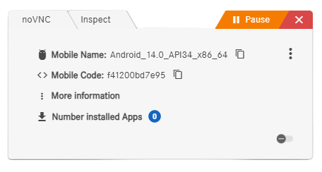

<picture>
  <source media="(prefers-color-scheme: dark)" srcset="https://raw.githubusercontent.com/cometa-rocks/cometa_documentation/main/img/logos/COMETAROCKS_LogoEslog_Y_W.png">
  <source media="(prefers-color-scheme: light)" srcset="https://raw.githubusercontent.com/cometa-rocks/cometa_documentation/main/img/logos/COMETAROCKS_LogoEslog_Y_B.png">
  
</picture>

# Mobile Automation Testing

## Overview

Welcome to the Cometa Mobile App Automation Testing guide! This guide walks you through automating mobile app testing using Cometa, from uploading your APK to running automated test cases on an emulator. Whether you're new to mobile automation or looking to streamline your workflow, this document will help you get started quickly and efficiently.

> [!TIP]
> Watch the [video tutorial](https://youtu.be/RWOVYCNVsRw) to see Mobile Automation Testing in action!
> *(Right-click to open in new tab)*

## Key Benefits

- **End-to-End Automation:** Automate the entire mobile app testing process, from APK upload to test execution.
- **Emulator Management:** Easily launch, interact with, and share emulators for collaborative testing.
- **Intuitive Interface:** User-friendly steps for uploading APKs, extracting app info, and building test cases.
- **Flexible Test Creation:** Use locators and inspector tools to create robust, repeatable test cases.
- **Collaboration:** Share emulator states with teammates for seamless teamwork and troubleshooting.

## Getting Started

Follow these steps to automate your mobile app testing with Cometa:

1. **Prepare Your APK File:**
   - Ensure you have the APK(s) you want to test. You may also use a helper APK to extract app and activity information.

2. **Upload APK(s):**
   - In Cometa, create a new feature (e.g., "Mobile App Testing Demo").
   - Upload your main APK and any helper APKs. Large files may take longer to upload and scan.

3. **Launch an Emulator:**
   - Click the "Start Mobile" button to spin up an emulator.
   - Once started, connect to the emulator using the "noVNC" button for remote interaction.

4. **Install APK(s) on Emulator:**
   - Use the interface to select and install your APK(s) onto the running emulator.
   - Confirm installation via pop-ups.

5. **Extract App Information:**
   - Use the helper APK or inspector tools to obtain package and activity information for your app.
   - Copy the required details (package name, activity, APK path) for use in your test case.

6. **Create a Test Case:**
   - In the step definition section, search for and use mobile actions.
   - Import a starter JSON template if available, and fill in the required fields (mobile code, capabilities, APK path, etc.).
   - Use the inspector tool to identify locator values for UI elements you want to interact with (e.g., buttons, pop-ups).
   - Add steps for each interaction (e.g., tap "Allow" three times, tap "Next", tap "Agree").

7. **Run and Monitor Your Test:**
   - Save and execute your test case.
   - Monitor execution via the emulator and review screenshots or video recordings.
   - Optionally, add a cleanup step to uninstall the app after testing.

8. **Share Emulator State (Optional):**
   - Use the share button to allow teammates to access the same emulator state for collaborative debugging or demonstration.

## Feedback

We value your feedback! If you have suggestions, encounter any issues, or want to share your experience with the Mobile Automation Testing feature, please let us know through [**co.meta's** Github](https://github.com/cometa-rocks/cometa/issues) repository.

## Version History

- v1.0.0: Initial release of Mobile Automation Testing documentation.

## License

This documentation is released under the [AGPLv3 License](https://github.com/cometa-rocks/cometa/blob/master/LICENSE).

Happy testing! 🚀 