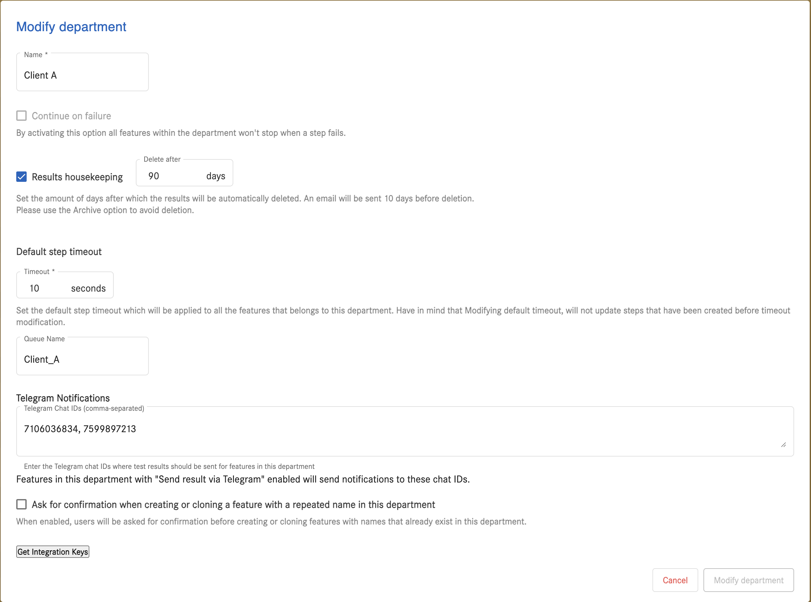
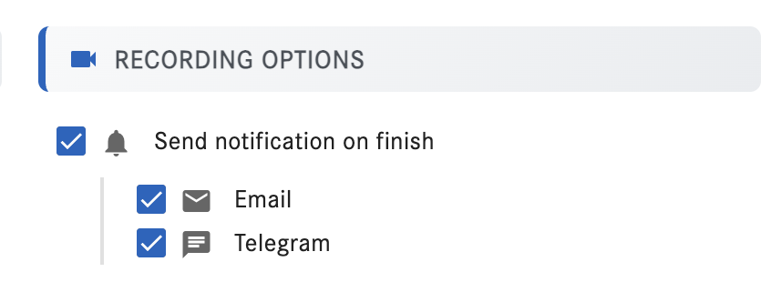
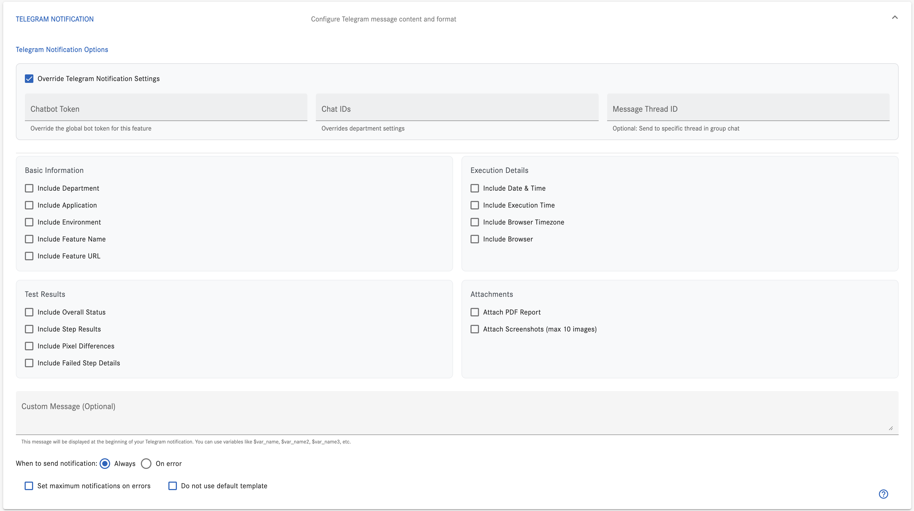

# Telegram Notifications Feature

<picture>
  <source media="(prefers-color-scheme: dark)" srcset="https://raw.githubusercontent.com/cometa-rocks/cometa_documentation/main/img/logos/COMETAROCKS_LogoEslog_Y_W.png">
  <source media="(prefers-color-scheme: light)" srcset="https://raw.githubusercontent.com/cometa-rocks/cometa_documentation/main/img/logos/COMETAROCKS_LogoEslog_Y_B.png">
  
</picture>

# Telegram Notifications Feature

> [!TIP]
> - Use your browser's search (Ctrl+F or Cmd+F) to find specific features
> - Watch our <a href="https://www.youtube.com/watch?v=j-hTiwg5o30" target="_blank">video tutorial</a> to see Telegram Notifications in action!

## What is the Telegram Notifications Feature?
The Telegram Notifications Feature provides a seamless way to receive test execution updates and results directly in your Telegram channels or groups. It offers flexible configuration options and supports both default and custom notification templates.

## Key Capabilities
- Custom Telegram bot integration
- Real-time test execution notifications
- Customizable notification templates
- PDF report attachments
- Screenshot attachments (up to 10)
- Variable content inclusion
- Conditional notification sending
- Maximum error notification limits
- Department-level configuration
- Group topic support

## Core Components

### Bot Configuration
- Default Cometa chatbot
- Custom bot token support
- Chat ID management
- Message thread ID for groups
- Department-level settings

### Notification Content
- Department information
- Application environment details
- Test execution status
- Step results
- Pixel differences
- Execution date and time
- Browser timezone information
- Custom variable inclusion
- PDF report attachments
- Screenshot attachments

### Sending Conditions
- Always send notifications
- Send on error only
- Maximum error notification limit

## Integration Points

### Department Settings
- Chat ID configuration
- Multiple recipient support
- Group topic management
- Default bot settings
- Custom bot integration

#### Configure department chat IDs

You can centrally configure Telegram chat IDs at the department level so all features in that department can send results to the right recipients.

- The "Modify department" page is available from the administration panel.
- Add one or more chat IDs (comma-separated). Features with "Send notification on finish → Telegram" enabled will deliver messages to these IDs.




## UI: Recording options

Enable Telegram notifications for a specific recording from the Recording Options panel.



 - **Send notification on finish**: Master switch to enable notifications when the run completes.
 - **Email**: Sends an email notification if configured.
 - **Telegram**: Sends a Telegram message using your department/project settings and template.

## Feature-level Telegram options

When editing a feature, you can override department defaults and configure the exact content, recipients, and attachments for Telegram notifications for that feature.



- **Override Telegram Notification Settings**: Enable to set feature-specific values.
  - **Chatbot Token**: Use a custom bot for this feature (overrides global/department bot).
  - **Chat IDs**: One or more chat IDs to receive messages (overrides department list).
  - **Message Thread ID**: Optional; send messages to a specific thread in a group.
- **Basic Information**: Include department, application, environment, feature name, feature URL.
- **Execution Details**: Include execution date/time, total time, browser timezone, and browser.
- **Test Results**: Include overall status, per-step results, pixel differences, and failed step details.
- **Attachments**: Attach PDF report and up to 10 screenshots.
- **Custom Message (Optional)**: Free-form leading text; supports variables like `$var_name`.
- **When to send notification**: Always or only on error.
- **Set maximum notifications on errors**: Limit error notifications.
- **Do not use default template**: Bypass the default template when needed.

## Best Practices

### Configuration
- Use custom variables for dynamic content
- Utilize group topics for better organization
- Regularly update chat IDs
- Monitor notification delivery


## Administration and Maintenance

### Delete Telegram authentication links (Django management command)

For testing or maintenance, you can remove Telegram authentication links stored in the backend. This is useful when a user re-links their Telegram account, when cleaning up test data, or when revoking access.

- **Command location**: backend service of the main Cometa project
- **Command name**: `delete_telegram_auth`

Run from the backend project directory where `manage.py` is located.

#### Usage

```bash
python manage.py delete_telegram_auth <chat_id>
python manage.py delete_telegram_auth --all
python manage.py delete_telegram_auth --user-email <email>
```

#### Options

- **chat_id (positional)**: Delete a single Telegram link by its chat ID.
- **--all**: Delete all Telegram authentication links. Use with caution.
- **--user-email <email>**: Delete links for a specific user by email (case-insensitive).
- **--yes**: Skip confirmation prompts (non-interactive mode). Applies when deleting by `chat_id`.

#### Behavior and notes

- **Delete by chat ID**: Shows link info and prompts for confirmation unless `--yes` is provided. After deletion, any Django sessions containing `telegram_chat_id` matching the deleted chat ID are also cleared.
- **Delete by user email**: Removes all links tied to the specified user; reports if none found.
- **Delete all**: Displays how many links were found and asks for confirmation before bulk deletion.

#### Examples

- Delete a single link by chat ID (with confirmation):

```bash
python manage.py delete_telegram_auth 123456789
```

- Delete a single link by chat ID (non-interactive):

```bash
python manage.py delete_telegram_auth 123456789 --yes
```

- Delete all links (will prompt):

```bash
python manage.py delete_telegram_auth --all
```

- Delete links for a specific user by email:

```bash
python manage.py delete_telegram_auth --user-email alice@example.com
```

## Need Help?

### Where can I get help?
- Join our [Discord community](https://discord.gg/PUxt5bsRej)
- Contact us at [tec_dev@cometa.rocks](mailto:tec_dev@cometa.rocks)

Happy testing! 🚀 